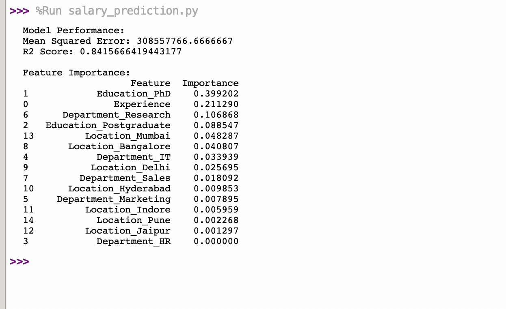

# 📊 Salary Prediction using Machine Learning

## 📌 Description
A machine learning project that predicts salary based on input features using ensemble learning techniques and data preprocessing.

## 🚀 Features
- Data preprocessing and cleaning  
- Model training using ensemble methods  
- Predict salary based on input data  
- Performance evaluation  

## 🛠️ Tech Stack
- Language: Python  
- Libraries: Scikit-learn, Pandas, NumPy  

## ▶️ How to Run
1. Install required libraries  
2. Run the Python file  
3. Provide input data to get predictions  

## 📈 Future Improvements
- Improve model accuracy  
- Add GUI dashboard  
- Deploy as a web application

## 📸 Output Screenshot

